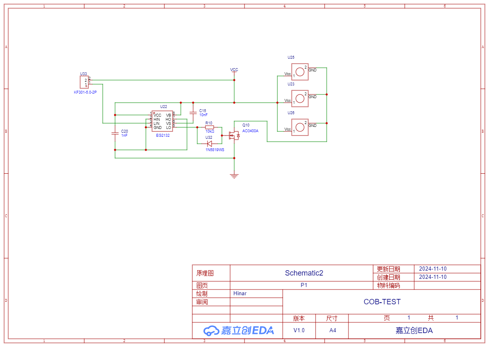

# 硬件平台再设计

## 前言 · 方案，过去与未来

### 基于2023-2024的原有方案

- **光源**: WS2812 LED
- **控制方式**: ESP8266
- **电源**: 5V

### 基于2024-2025的改进方案

- **光源**: COB LED (主光源) + RGBW / WS2812 LED (辅光源)
- **控制方式**: ESP8684 / ESP8266
- **电源**: 220V

## 构想 · 设计方向

### 阻容降压电路转WS2812

- [x] **优势**：
  - 成本低，适用于较简单的调光场景
  - 不需要额外控制协议，便于与现有ESP8266控制逻辑集成
- [ ] **劣势**：
  - 稳定性和调光效果较差，对LED寿命可能有影响
  - 高压情况下的电源隔离较难实现，存在一定安全隐患

### 可控硅调光

- [x] **优势**：
  - 适合LED调光，稳定性较高
  - 成本低、结构简单，适合常规调光需求
- [ ] **劣势**：
  - 调光精度有限，对电源质量要求较高
  - 低亮度可能出现闪烁现象，不适合精确的颜色控制

### DALI

- [x] **优势**：
  - 精准调光控制，支持调光、调色以及分组控制等高级功能
  - 支持多点和分布式控制，可扩展性强
  - **标准化接口**，便于与其他智能照明系统集成
  - 提供低压隔离，提升系统安全性
- [ ] **劣势**：
  - 控制系统和灯具成本高
  - 需要DALI接口模块与电源适配，硬件设计较为复杂
  - 对开发和调试有较高的技术要求，需掌握DALI协议相关知识

### COB LED

- [x] **优势**：
  - 高照度、显色指数
  - 基于PWM调光控制简单
- [ ] **劣势**：
  - 无法精细调色温
  - 热量较大注意散热

## 表格 · 用料罗列

| 型号 | 价格 | 类别 | 是否选用 |
| --- | --- | --- | --- |
| Bridgelux Vesta Series | 21r x 35 | 双色温COB LED | X |
| CLU038 | 118r x 1| 双色温COB LED | X |
| CXM-32 | 187r x1 | 双色温COB LED | X |
| WS2812 | 10/24r x 24 | RGB | X |
| [XL-5050RGBW](https://item.szlcsc.com/8342963.html?fromZone=s_s__%2522Cree%2520XLamp%2520RGBW%2520LED%2520(XHP70.2)%2522) | 0.31r x 10 | RGBW | √ |
| [HL-LM002H384W-5B2C5(Ra4)(ANSI-4000K)](https://item.szlcsc.com/24012658.html?fromZone=s_s__%2522cob%2522) | 1.8r x 10 | 单色温 COB LED | √ |

## 设计 · 从原理图入门到PCB自动布线

1. 经过一周的硬件知识补全，复刻了一个推挽电路驱动MOS管的大部分内容，但由于对原理的错误认知以及对安全性的进一步考量进而画了第二版电路
  

2. 将原先的推挽改为了更具安全性的EG2312半桥驱动芯片驱动MOS管，但由于对于低端驱动有错误认知以及未隔离3.3v驱动电流进而画了第三版电路
  

3. 在这一版本中终于验证成功，但是忘记引出地线导致飞线时的纹波干扰和一些小问题频发
  

4. 这个版本作为承上启下的一版修复了之前已知的错误，同时测试3.3v稳压的功能，以便后续单片机和RGBW的供电测试
  
