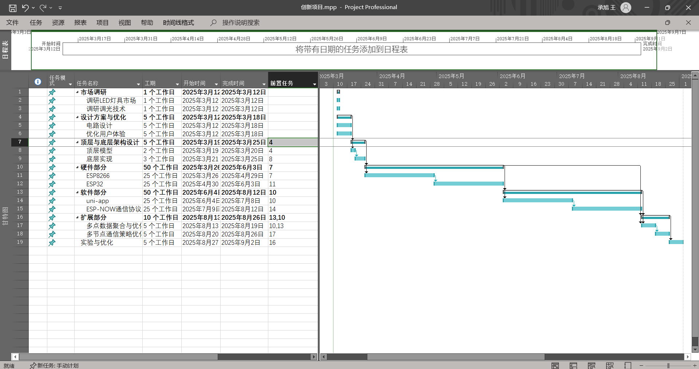

# 项目资料及清单

## 目录组织结构

**光照度控制系统**
- [项目总体描述](#项目总体描述)
    - 项目说明 | instruction
- [当前子项目描述](#当前子项目描述)
    - 子项目说明 | instruction
- [项目成员](#项目成员)
- [思维导图](#思维导图)
- [工作分解结构WBS](#工作分解结构WBS)
- [WBS词典](#WBS词典)
- [项目的系列草图](#项目的系列草图)
- [项目组成图](#项目组成图)
- [体系结构图](#体系结构图)
- [项目代办事项](#项目代办事项)
- [冲刺待办事项](#冲刺待办事项)
- [Project计划进度甘特图](#Project计划进度甘特图)

## 项目总体描述

**光照度控制系统 / CSDistrLighting**

本项目是基于ESP芯片的分布式照明控制系统 (CSDL) ，包含配套仿真软件，提供办公、室内多场所的方案
最终目标是完成分布式照明的主控制系统

This Project is about the Control System of Distributed Lighting (CSDL) Based on ESP Chips, also conclude the simulation software, provide solutions for multiple locations in offices and indoor areas.  
The final goal is to complete the Main Control System to the Distribute Lighting.

## 当前子项目描述

目前的进度是测试 "一灯一控" 平台的完成情况，并完成光照度控制系统 (CSDL) 的仿真软件 (CSilver) 的基本功能
最终的目标是完成动态组合的分布式系统控制,包括多灯一控、多灯多控等自由度较高的定制方案

Current status is to test the completed process of "ONE led and ONE master" platform, also complete the base function of the CSDL's Simulation(CSilver).
The further goal is to complete the distribute system of dynamic compose, include "MULTIPLE led and ONE master" / "MULTIPLE led and MULTIPLE master" or other customized solutions as one like.

## 项目成员

| 成员 | 2025春 | 是否为组长 | 2024秋 | 是否为组长 | 2024春 | 是否为组长 |
| :---: | :---: | :---: | :---: | :---: | :---: | :---: |
| 黄翊轩 | :white_check_mark: | :white_check_mark: | :white_check_mark: | :x: | | |
| 刘青青 | | | :white_check_mark: | :white_check_mark: | | |
| 辛宇轩 | | | | |:white_check_mark: | :white_check_mark: |
| 王承旭 | :white_check_mark: | :x: | :white_check_mark: | :x: | | |
| 林嘉铭 | :white_check_mark: | :x: | :white_check_mark: | :x: | | |
| 梁岳洋 | :white_check_mark: | :x: | | | | |
| 柏麒 | :white_check_mark: | :x: | | | | |
| 宋壮壮 | :white_check_mark: | :x: | | | | |
| 宗嗣华 | | | | | :white_check_mark: | :x: |
| 吴昊楠 | | | | | :white_check_mark: | :x: |
| 孙懿 | | | | | :white_check_mark: | :x: |
| 邓仕林 | | | | | :white_check_mark: | :x: |

## 思维导图

目前思维导图如下:

附: [源文件](./光照度控制系统.mm)

## 工作分解结构WBS

## WBS词典

## 项目的系列草图

## 项目组成图

## 体系结构图

## 项目代办事项
按当前紧迫性排序的与项目有关的全部工作

## 冲刺待办事项
按当前紧迫性排序的与项目有关的本学期全部工作

## Project计划进度甘特图

目前项目进度如下: 

附: [**源文件**](./创新项目.mpp)