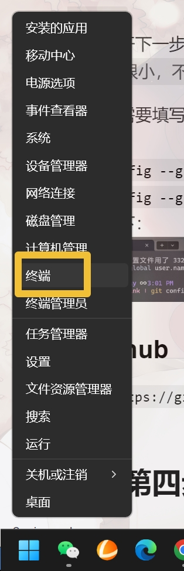
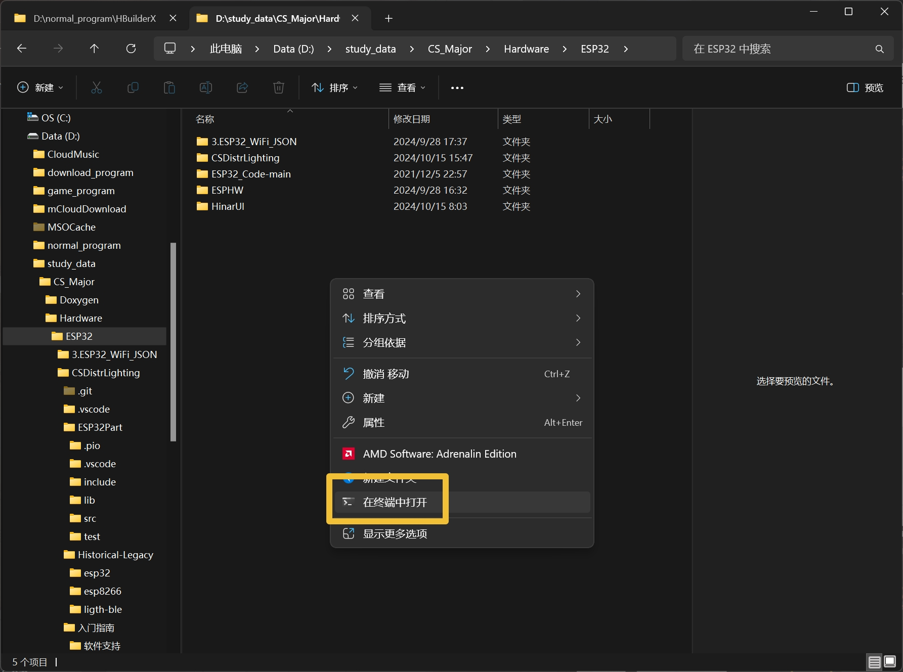
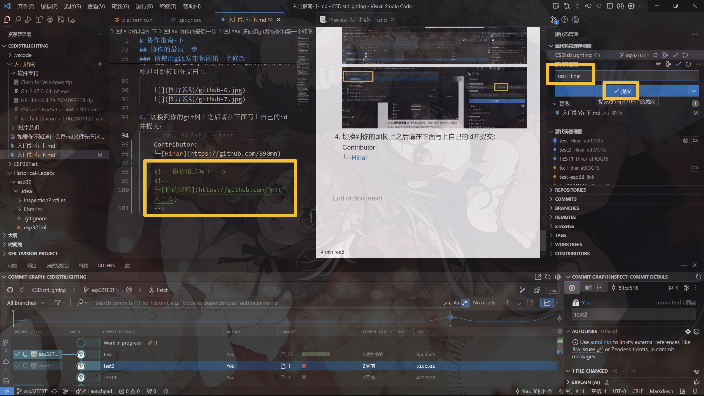

# 协作指南-下

## 协作的第三步

> 注：有了梯子之后记得挂，大部分软件官网都是挂着比不挂块一百倍

### 安装 git

1. 通过本目录下的 **软件支持** 文件夹内找到 `Git-2.47.0-64-bit.exe`
2. 双击打开下一步全部勾选安装，一路默认点到底
    > 注：很小，不用担心c盘占用
3. 初始化需要填写用户信息，可反复提交修改
    右键Win图标选中 **终端** 或者你喜欢的打开方式  
    

    `git config --global user.name "你的昵称"`  
    `git config --global user.mail "你的邮箱"`  
    效果如下：  
    
4. 使用git大部分时候都挂着梯子，但是要单独设置代理，仍然是在终端输入：
    `git config --global http.proxy 'http://127.0.0.1:7890'`
    `git config --global https.proxy 'https://127.0.0.1:7890'`

### 注册 github

1. 访问 `https://github.com`
    
2. 按照提示一步步写就行了
    
3. 注册完记得告诉我你的 **用户名/昵称/邮箱** 这样我才能拉你协作：
    

## 协作的第四步

### 配置 VS Code + PlatformIO

platformIO可以很方便的配置ESP32和ESP8266，故此处省略Arduino和python环境合并为统一工具链开发

1. 在 **VS Code** 扩展中搜索 `PlatformIO IDE`
    安装时会同步一些必要设置，需要提前配置VSCode的代理不然跑不动
    

    按照步骤打开设置，搜索代理并填入代理地址
    

    完成代理配置即可安装插件，注意右下角实时进度，直到提示重启VS Code
    

2. 选中ESP32/ESP8266项目用VS Code打开

    > 这两历史遗留我都需要时间改完，此处暂时省略待后文补全

3. 在 **PIO Home** 中安装底板驱动如下：

    

4. 项目如报错无库文件请到 **PIO Home** 的 **Libraries** 中搜索对应模块安装

    

5. 正常情况下项目引入由根目录的 `platformio.ini` 配置 (类似CMake管理机制)，第一次打开我配置好的项目会自动安装对应库

### 注册 微信开发者 并安装 微信开发者工具

1. 访问 `https://mp.weixin.qq.com/cgi-bin/wx`
2. 按照提示一步步来就行
3. 注册完之后在 **管理-开发管理-开发者ID-AppID** 复制下来保存好
    
4. 通过本目录下的 **软件支持** 文件夹内找到 `wechat_devtools_1.06.2407120_win32_x64.exe`
5. 双击打开一路默认点到底

### 安装 HbuilderX

1. 通过本目录下的 **软件支持** 文件夹内找到 `HBuilderX.4.29.2024093009.zip`
2. 解压即可使用，找个你喜欢的地方放着就行
3. 双击 `HBuilderX.exe` 运行
4. 在软件中打开项目目录，点击 **详情** 找到 **AppID** 替换成你刚复制的
    
5. 先点击编译，然后是预览，点击自动预览，这样就会直接推送到你的手机上
    

## 协作的最后一步

### 请使用git发布你的第一个修改

1. 首先 **git clone** 本项目到本地

    1.请挑选一个你喜欢的地方，右键选择打开终端，输入：
    `git clone https://github.com/890mn/CSDistrLighting`

    
2. 进入到这个项目右键使用VS Code打开:

    
3. 找到 **源代码管理** 即可看到git管理，点击 `main` Branch, 创建新分支，输入你的分支名称即可跳转到分支树上

    
    
4. 切换到你的git树上之后请在下面写上自己的id并提交：

    Contributor:
    [Hinar](https://github.com/890mn)
    [wocaxle](https://github.com/wocaxle)
    [EVERLASTING7](https://github.com/EVERLASTING7)
    [Baek-cell](https://github.com/Baek-cell)
    <!-- 模仿格式接在后面 -->
    <!--
    [你的昵称](https://github.com/你的个人主页)
    -->

    

    第一次提交是 **git commit**
    第二次提交是 **git push**
    VS Code 提供了图形接口所以你大概了解一下就好
5. 回到 **Github** 切换到你自己的分支会见到这个 **merge** 选项

    

    可以添加一些短的说明方便后期review，确认无误即可合并

    

---

至此，
恭喜你，看完了这两篇长的要死的指南！  
写的不是那么完美，如果没看懂就直接来问我

点击这里回到 [主页](../README.md) 继续阅读
### **智能药盒升降与取放控制系统详解**

#### **1. 系统概述**
本系统基于 **STM32** 作为主控，采用 **舵机控制** 实现药盒升降，并结合 **智能路径规划** 和 **异常检测**，确保药盒取放的 **精准性** 和 **安全性**。  
通过 **PID 算法** 对舵机运动进行优化，减少机械抖动，使升降杆平稳运行。同时，系统利用 **光电传感器** 和 **限位开关** 进行实时监测，及时识别异常情况，如药盒未放回、错误取药或机械阻塞，并触发报警机制。

---

### **2. 舵机控制实现精准升降**
**舵机的精确控制是核心之一**，为了确保药盒取放时位置准确，我们采用 **PWM 信号驱动舵机**，并结合 **PID 控制** 进行精准调整。

**PWM 驱动原理**
舵机通过 **PWM 占空比** 来控制转动角度，通常 PWM 信号周期设定为 **20ms**，而脉冲宽度在 **500μs 至 2500μs** 之间对应 **0° 到 180°** 的转动范围。

```c
void Servo_SetAngle(uint16_t angle) {
    uint16_t pulse = (angle * 10) + 500; // 角度映射为 PWM 脉宽
    TIM_SetCompare2(TIM3, pulse);  // 设置 PWM 输出
}
```

然而，直接改变舵机角度可能会导致 **振动和过冲**，因此，我们加入 **PID 控制** 进行动态调整，使其逐步趋近目标角度，达到更稳定的运行效果。

```c
float PID_Calculate(PID_t *pid, float current) {
    pid->error = pid->target - current;
    pid->integral += pid->error;
    float derivative = pid->error - pid->last_error;
    float output = (pid->Kp * pid->error) + (pid->Ki * pid->integral) + (pid->Kd * derivative);
    pid->last_error = pid->error;
    return output;
}
```

这样，舵机的加速、减速过程更加平稳，避免了因突然变动导致的振动。

---

### **3. 取放路径优化与智能调度**
在取放药盒时，我们希望 **尽量减少升降杆的移动**，以提高效率。因此，系统会分析当前的药盒排列方式，并优先 **取放相邻药盒**，降低机械运动冗余。

**路径优化的核心逻辑**
1. **任务存储**：所有待执行的取放任务存入 **优先队列**
2. **任务排序**：按**相邻原则**和**优先级**进行排序
3. **最短路径计算**：基于当前升降杆位置，计算最优移动顺序
4. **执行取放**：控制舵机移动至目标位置，完成取放操作

```c
void SortTasks() {
    for (int i = 0; i < taskCount - 1; i++) {
        for (int j = i + 1; j < taskCount; j++) {
            if (taskQueue[i].priority > taskQueue[j].priority) {
                MedicineTask temp = taskQueue[i];
                taskQueue[i] = taskQueue[j];
                taskQueue[j] = temp;
            }
        }
    }
}
```

这样，我们确保在多个药盒需要操作时，**升降杆不会无谓地重复运动**，从而提高整体效率。

---

### **4. 取放药盒时的异常检测**
为了确保药盒 **精准取放**，我们需要对取药过程进行 **实时监测**，如果发生异常情况，系统将立即触发警报。

#### **检测方式**
- **光电传感器**：检测药盒是否放回
- **限位开关**：防止升降杆超出边界
- **超时检测**：防止舵机卡死

```c
if (!CheckBoxInPlace()) {
    LCD_ShowString(0, 0, "Warning: Box Missing!");
    Buzzer_Alert();
}
if (!CheckServoLimit()) {
    LCD_ShowString(0, 0, "Error: Servo Overrun!");
    StopServo();
}
```

**异常情况及响应**
| **异常情况**    | **检测方法**          | **响应策略**               |
|---------------|------------------|----------------------|
| 药盒未放回     | 光电传感器        | 显示警告+蜂鸣器警报 |
| 取错药盒       | 任务记录+传感器    | 触发错误提示         |
| 机械阻塞       | 舵机电流异常      | 终止运动，进入安全模式 |

**这样，我们可以确保药盒管理系统安全、可靠，并有效防止错误操作。**

---

### **5. 总结**
本方案从多个角度优化了 **药盒管理系统** 的核心功能：
1. **舵机精准控制**：
   - 采用 **PWM 控制** + **PID 调节**，实现平稳升降
   - 避免舵机振动，提高取放稳定性
2. **路径优化与调度**：
   - **智能排序任务**，减少升降杆不必要移动
   - **相邻优先原则**，提高取放效率
3. **异常检测与安全保障**：
   - 结合 **光电传感器+限位开关** 进行实时监测
   - 发生异常时 **蜂鸣器+LCD 显示警报**

**最终，系统能够精准、高效、安全地管理药盒取放，为自动化药品管理提供了有力支持。**  

如果有需要补充或者调整的地方，欢迎进一步探讨！