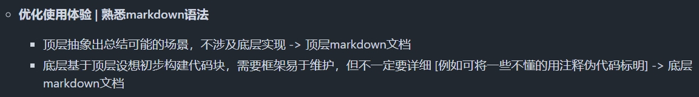

# 顶层概念设计

本文档为基于第二阶段的markdown顶层设计，提供了场景的抽象，不涉及具体实现

其中语法规范可以参考如下链接：[语法查询](https://markdown.com.cn/basic-syntax/)

## 提案

先提出设想，总结的事交给下个环节来做，这里就畅所欲言吧

### 设计特定的灯光控制

- [x] 已合并TODO | [**日夜模式**](Top-level.md#日夜模式)

- **白天/夜晚模式** 做出区分
- 白天的光线比较亮就调低一些亮度，夜晚会比较刺眼就设置一些暖暗光

---

### 分划区域

- [ ] 未分配 | 目前状态：待规划

- 家庭、商店、博物馆等需要 **多区域不同光照** 的环境作为背景
- 每个区域内独立灯光调控

---

### 触发式亮度调节

- [ ] 未应用 | 目前状态：待规划

- 当有人进入时灯光自动增强，离开后自动降低或关闭，以实现节能

## TODO List

基于提案进行合并总结，整合方案，具体的实现就交给底层文档来实现吧

### 日夜模式

- [x] 已关联提案 | [**设计特定的灯光控制**](Top-level.md#设计特定的灯光控制)
- [x] ESP32
- [x] Web
- [ ] ESP8266

**顶层概念构建:**

- ESP32基于环境光传感器的读数自动调节灯条的亮度，以保持目标光照度
- 模式切换通过Web端设计开关实现
- 符合场景如办公室、实验室等需要恒定照明的场景
- 

### 2. **区域照明**

- **描述**：将不同灯条划分成区域，由ESP32通过ESP-NOW单独控制，达到区域化的调节。
- **场景**：家庭、商店、博物馆等需要多区域不同光照的环境。
- **拓展**：实现不同的灯光颜色、亮度设置，以配合环境变化。

### 3. **光线同步**

- **描述**：在多个ESP8266节点间同步光照水平，协调多区域灯光的强度，使得整体光照和谐一致。
- **场景**：大型开放式办公区、展厅等。
- **拓展**：加入算法实时调整，保证相邻区域的亮度过渡自然。

### 4. **触发式亮度调节**

- **描述**：当有人进入时灯光自动增强，离开后自动降低或关闭，以实现节能。
- **场景**：楼道、仓库、停车场。
- **拓展**：加上延迟机制和渐变效果，让光线变化更自然。

### 5. **预设模式**

- **描述**：提供若干预设模式供用户选择，比如“工作模式”、“放松模式”，不同模式下光照度不同。
- **场景**：办公空间、家庭。
- **拓展**：通过手机APP或物联网接口设置模式，或自动切换预设模式。
