# 协作指南-下

## 协作的第三步

> 注：有了梯子之后记得挂，大部分软件官网都是挂着比不挂块一百倍

### 安装 git

1. 通过本目录下的 **软件支持** 文件夹内找到 `Git-2.47.0-64-bit.exe`

2. 双击打开下一步全部勾选安装，一路默认点到底
    > 注：很小，不用担心c盘占用

3. 初始化需要填写用户信息，可反复提交修改
    右键Win图标选中 **终端** 或者你喜欢的打开方式
    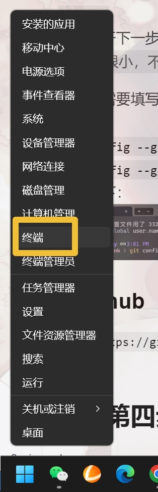
    `git config --global user.name "你的昵称"`
    `git config --global user.mail "你的邮箱"`
    效果如下：
    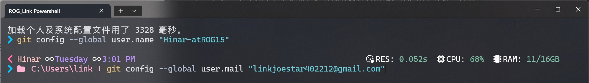

4. 使用git大部分时候都挂着梯子，但是要单独设置代理，仍然是在终端输入：
    `git config --global http.proxy 'http://127.0.0.1:7890'`
 
    `git config --global https.proxy 'https://127.0.0.1:7890'`

### 注册 github

1. 访问 `https://github.com`
    

2. 按照提示一步步写就行了
    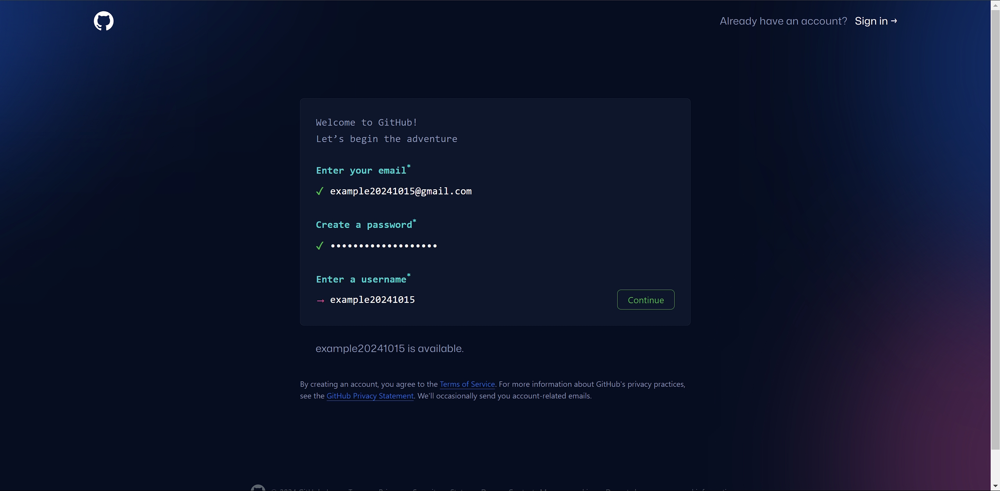

3. 注册完记得告诉我你的 **用户名/昵称/邮箱** 这样我才能拉你协作：
    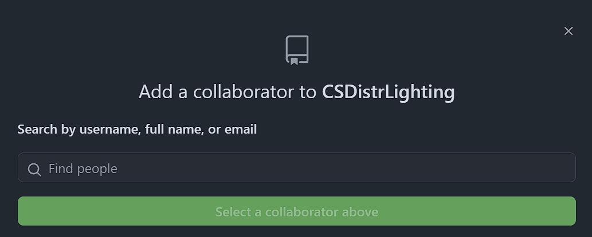

## 协作的第四步

### 配置 VS Code + PlatformIO

platformIO可以很方便的配置ESP32和ESP8266，故此处省略Arduino和python环境合并为统一工具链开发

1. 在 **VS Code** 扩展中搜索 `PlatformIO IDE` 
    安装时会同步一些必要设置，需要提前配置VSCode的代理不然跑不动
    

    按照步骤打开设置，搜索代理并填入代理地址
    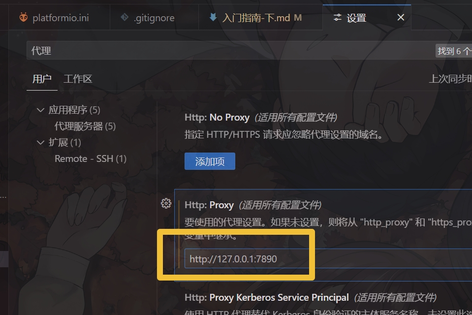

    完成代理配置即可安装插件，注意右下角实时进度，直到提示重启VS Code
    

2. 选中ESP32/ESP8266项目用VS Code打开

    > 这两历史遗留我都需要时间改完，此处暂时省略待后文补全

3. 在 **PIO Home** 中安装底板驱动如下：

    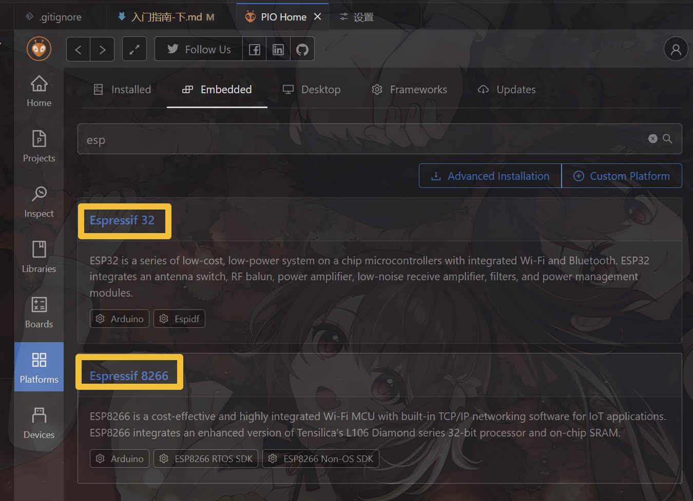

4. 项目如报错无库文件请到 **PIO Home** 的 **Libraries** 中搜索对应模块安装

    

5. 正常情况下项目引入由根目录的 `platformio.ini` 配置 (类似CMake管理机制)，第一次打开我配置好的项目会自动安装对应库

### 注册 微信开发者 并安装 微信开发者工具

1. 访问 `https://mp.weixin.qq.com/cgi-bin/wx`

2. 按照提示一步步来就行

3. 注册完之后在 **管理-开发管理-开发者ID-AppID** 复制下来保存好
    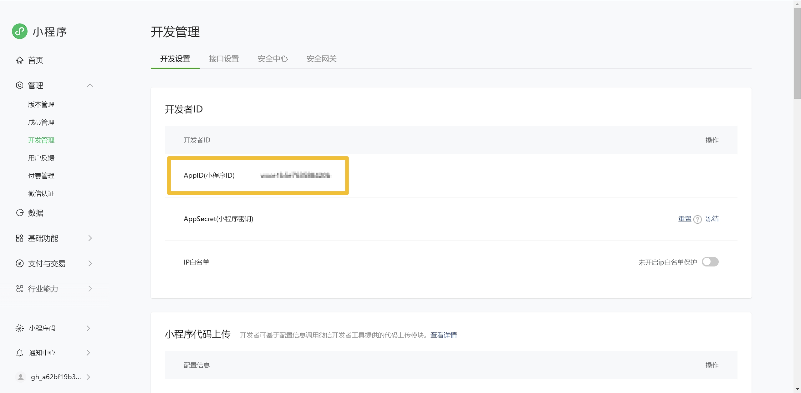

4. 通过本目录下的 **软件支持** 文件夹内找到 `wechat_devtools_1.06.2407120_win32_x64.exe`

5. 双击打开一路默认点到底

### 安装 HbuilderX

1. 通过本目录下的 **软件支持** 文件夹内找到 `HBuilderX.4.29.2024093009.zip`

2. 解压即可使用，找个你喜欢的地方放着就行

3. 双击 `HBuilderX.exe` 运行

4. 在软件中打开项目目录，点击 **详情** 找到 **AppID** 替换成你刚复制的
    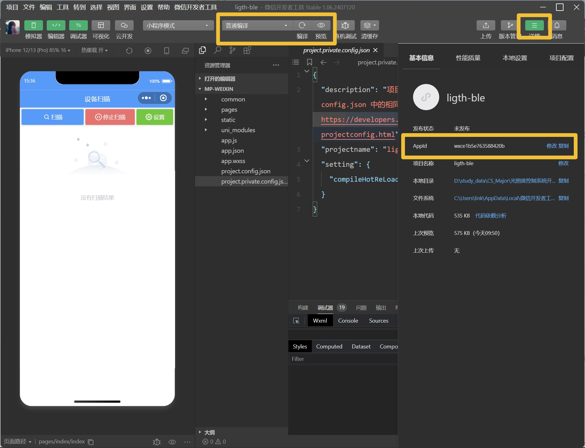

5. 先点击编译，然后是预览，点击自动预览，这样就会直接推送到你的手机上
    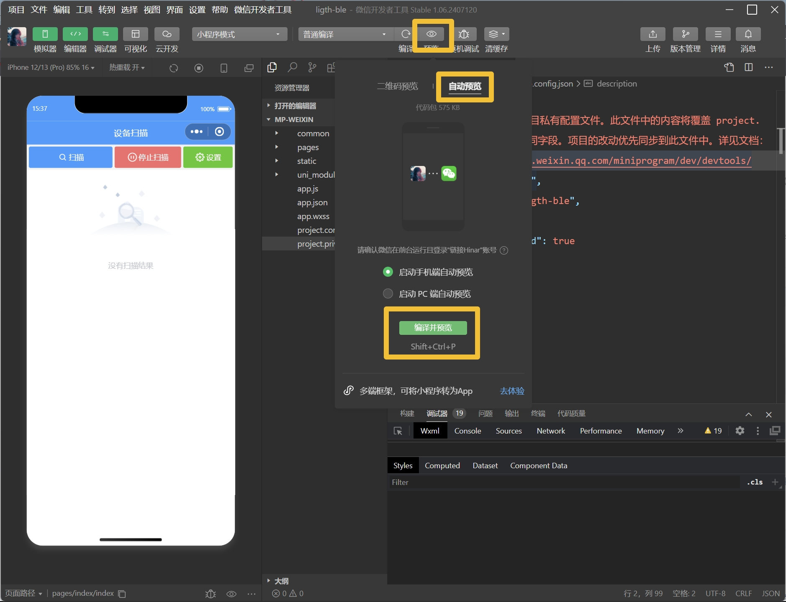

## 协作的最后一步

### 请使用git发布你的第一个修改

1. 首先 **git clone** 本项目到本地

    1.请挑选一个你喜欢的地方，右键选择打开终端，输入：
    `git clone https://github.com/890mn/CSDistrLighting`

    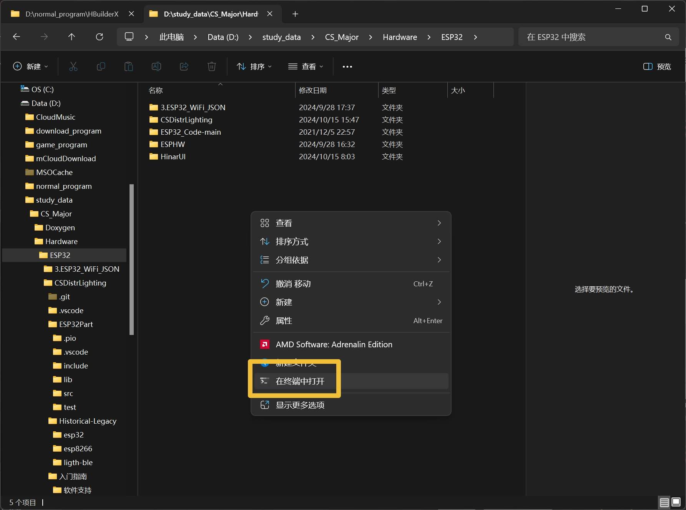

2. 进入到这个项目右键使用VS Code打开:

    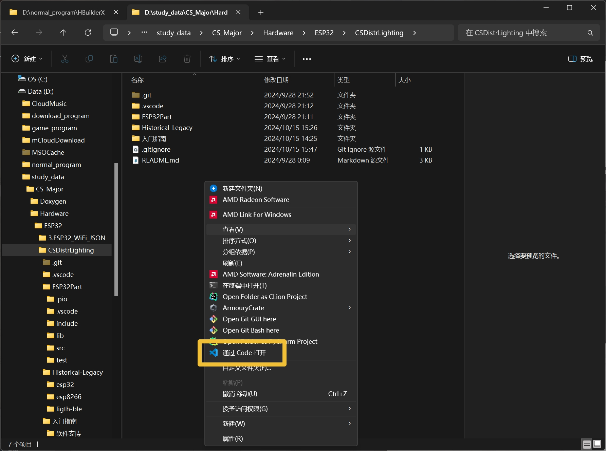

3. 找到 **源代码管理** 即可看到git管理，点击 `main` Branch, 创建新分支，输入你的分支名称即可跳转到分支树上

    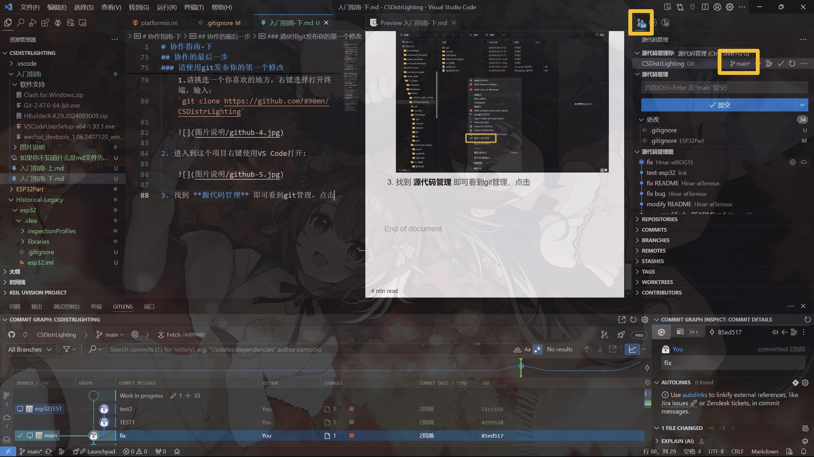
    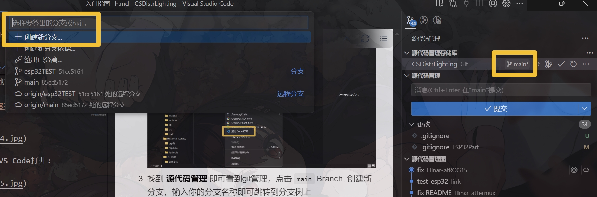

4. 切换到你的git树上之后请在下面写上自己的id并提交：

    Contributor:
    [Hinar](https://github.com/890mn)
    [wocaxle](https://github.com/wocaxle)
    <!-- 模仿格式接在后面 --> 
    <!--
    [你的昵称](https://github.com/你的个人主页)
    --> 

    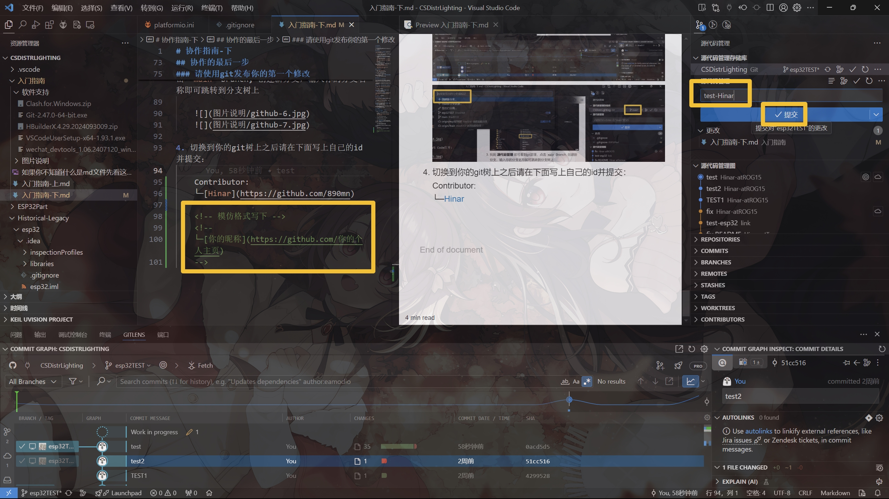

    第一次提交是 **git commit**
    第二次提交是 **git push**
    VS Code 提供了图形接口所以你大概了解一下就好

5. 回到 **Github** 切换到你自己的分支会见到这个 **merge** 选项

    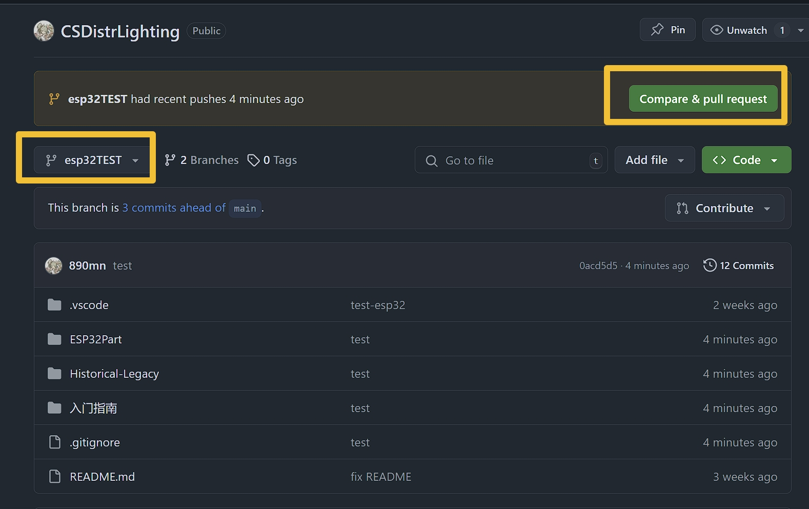

    可以添加一些短的说明方便后期review，确认无误即可合并

    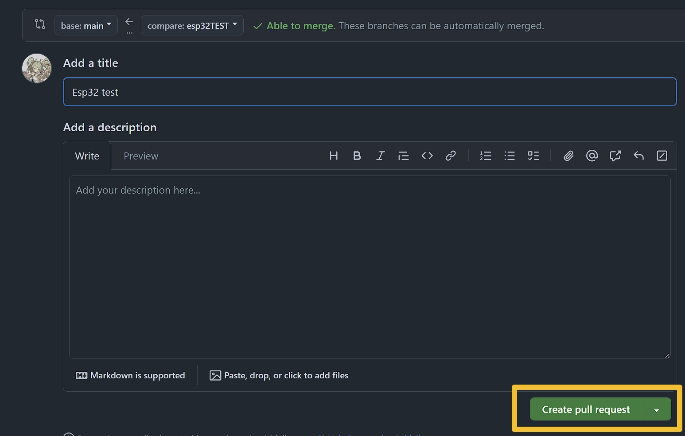

    然后我上线审核一遍有无冲突等小检查就可以正式并入了

---

至此，
恭喜你，看完了这两篇长的要死的指南！
写的不是那么完美，如果没看懂就直接来问我
