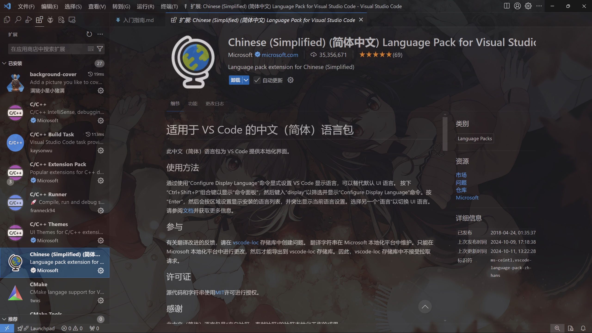

# 协作指南-上

## 协作的第零步

### 如何打开一个.md文件?

1. 当你在读这个问题的时候那就意味着你需要先按照这个百分百成功的步骤开始： 用 **记事本** 打开

2. 如果你能明白以上那行字 ~~就说明你会用电脑~~ 那就可以开始安装VSCode进而看懂markdown语法的魅力

## 协作的第一步

### 如何安装VS Code?

1. 通过本目录下的 **软件支持** 文件夹内找到 `VSCodeUserSetup-x64-1.93.1.exe`

2. 双击打开下一步全部勾选安装，效果如下：

3. 如有可能，记得先重启让他的PATH生效，不然遇到BUG概不负责(大概率也没啥BUG就是了)

### VS Code内部怎么配置?

1. 在侧边栏找到 **扩展(Ctrl + Shift + x)**

2. 搜索 `Markdown Preview Enhanced` 并安装，效果如下：

3. 此时你会找到这个按钮或者右键找到markdown渲染：

> 注：位置不一定在指的地方但是图标一定长这样

以上内容做完就可以顺利的打开本markdown说明书，享受你的markdown体验吧

4. 其他VS Code有用/好用/心情件插件

    1. 看不懂就先装个简中
    

    2. 后面协作的时候这个可以增强git树的视觉反馈
    

    3. 即使我现在不说你自己写代码应该也会弹窗让你装的语言扩展
    

    4. 成天看着黑/白框多难受呐加个背景多好 [注：非常不建议白底]
    

    5. ~~有点长懒得现在写~~ 其他插件等用到的时候再说
    
## 协作的第二步

### 打破信息的门槛——挂个梯子先

1. ~~由于作者被查水表了故此处没有github链接~~

2. 通过本目录下的**软件支持**文件夹内找到 `Clash.for.Windows.zip`

3. 解压即可使用，自己挑个喜欢的地方放

4. 双击 `Clash for Windows.exe` 运行

5. 首页应当如下：注意勾选 **System Proxy** 开启全局代理

6. 接下来转到 **Profiles** 按照下文操作：

    1. 复制我的订阅链接：https://sub.xfltd.cfd/cctv/user/client/get?token=63264ed39766d9c48a7bf61529f67aa7

    2. 点击这个 **粘贴键** 或者点前面这个框 Ctrl-v

    3. 点击这个 **Download** 下载订阅

    

7. 日常使用转到 **Proxies** 进行节点选择

    1. **Global** 全局代理，默认只走代理通道，如访问网站不明确服务器位置可挂全局

    2. **Rule** 规则代理，自动决定是否走代理，大部分时候挂这个没啥问题

    3. **Direct** 全局直连，不使用梯子时挂这个状态即可退出，如果不是这个状态退出容易造成 **代理设置错误** 的网络问题，如遇该情况再打开该软件即可

    4. 网络状态可以通过右上角第三个小图标点击测速，选择Pin通延迟最小的那个就行

    5. 如果遇到全红 **Timeout** 情况请 **先挂Direct** 再进入 **Profiles** 点击代理框右侧的小循环键更新订阅

    6. 如果在第**5**步无法成功更新请跟我说，有订阅链接强制更新情况等特殊情况我再解释

    

8. 有些软件不走全局代理怎么办？

    1. 首先找到该软件的 **网络** 或者 **代理(Proxy)** 选项

    2. 选择 **Sock5** 代理，参数填写 `127.0.0.1:7890` 本地环回+代理端口

    3. 特殊情况特殊对待，建议先百度
